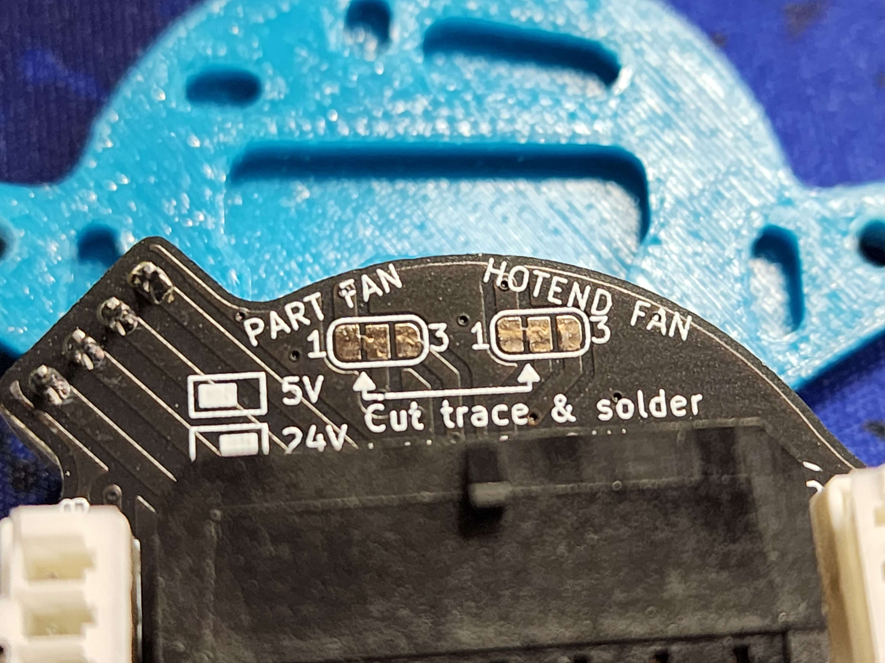
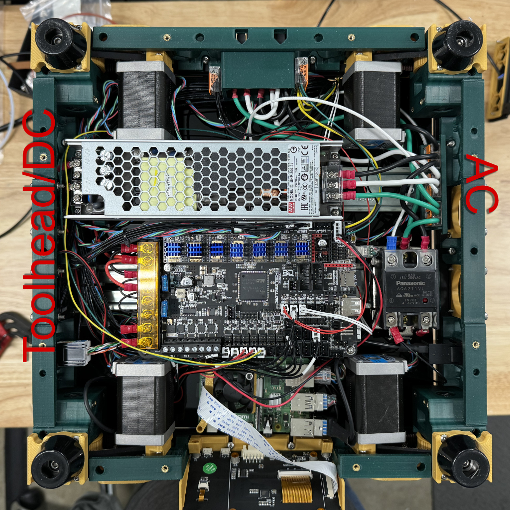
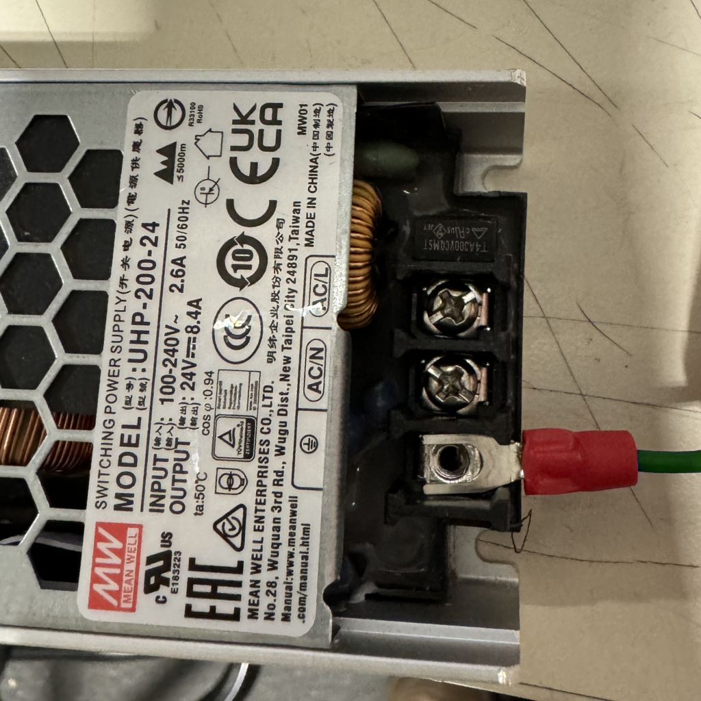

# **Please note this document is a work in progress and will be updated periodically.**
While generally consistent with generic Micron builds the information here is intended specifically for [West3D's Micron+ kit](https://west3d.com/products/micron-plus-180-self-source-configurator-by-west3d-printers-for-ants). If you find errors, omissions, or have suggestions please feel free to open an issue.

# Printed parts, manual, CAD
- Your main source of information is Hartk's GitHub repo: https://github.com/PrintersForAnts/Micron. Please read through this document before you start printing your parts, as there are some modifications we recommend.
- When printing parts be sure to use the 180 files.
- When printing the panel clips you should use the 3mm foam variants.
- We found it useful to have an extra PCB DIN clip to use for securing wires (more on that later).
- These modified Z belt covers work well and give a little more clearance for the A/B motors: https://github.com/PrintersForAnts/Micron/tree/main/Mods/Kayos%20Maker/Flat%20Z%20Belt%20Covers/STLs
- A modified bowden tube entry that adds an ECAS fitting can be found in this repository
- If you plan on moving the printer often this spool holder is convenient: https://www.printables.com/model/542953-voron-v02-foldable-spool-holder
# Toolhead
There are several toolhead choices. The BOM stock toolhead is the Mini Stealthburner.

Our choice is the Dragonburner. The Dragonburner (or Rapidburner) offer better part cooling with two 4010 blowers. You can get the files at https://github.com/chirpy2605/voron/tree/main/V0/Dragon_Burner. You need to use the STL files in the v0.2 directory. There's even a cowl with the Micron logo!

We usually pair the Dragonburner with the Orbiter 2 extruder, but there are many compatible options including G2SA.

A few notes on toolhead boards:
- If you're using the Pancake toolhead board and harness you can get the toolhead board mount at https://github.com/christophmuellerorg/voron_0_pancake_board. This will put the toolhead harness at a 45º angle but works fine.
- If you're using the EBB36 CAN board we recommend the mount by KayosMaker at https://github.com/KayosMaker/CANboard_Mounts/tree/main/STLs/BTT_EBB36_1.0_Mounts

Please note that if you are using the pancake board with 24v fans you will need to cut the trace(s) between pads 1&2 and solder jump pads 2&3:

Photo courtesy of ZombieHedgehog
# Toolhead mount & probe
- We recommend using Boop as the toolhead mount and Z probe/endstop. You can get the files at https://github.com/PrintersForAnts/Boop/tree/main
- The DragonBurner toolhead requires a modified Boop front: https://github.com/chirpy2605/voron/tree/main/general/Alternative_Voron_Mounts

# Screen
We recommend the BTT TFT43 screen if you're using a Raspberry Pi. If you're using a BTT Pi we recommend you either don't use a screen or source a different option; the BTT TFT35 SPI screen doesn't meet our usability requirements. You will need:
- The mount in the BTT_TFT43 folder in this repository
- The front skirt, accent, and bezel files from https://github.com/PrintersForAnts/Micron/tree/main/Mods/hartk1213/180/Waveshare4.3

# Electronics bay
Our kit uses a slightly different electronics layout for convenience. Looking at the electronics bay (note that your kit may have different motors):

- The first DIN rail mounts the PSU and a DIN mount for 3x three port Wagos.
- The second DIN rail mounts the controller board and SSR for the bed.
  This lets us keep the AC wiring short and contained to the right side (in this view) of the electronics bay. The toolhead wiring and most of the DC wiring is the run on the left side of the bay. We found it helpful to install a DIN rail mount next to the left side of the controller board to tie off wires.

Please note that the spade lugs don't slide into the AC input screw terminals; you need to remove the screw, put the lug in from the top, then replace the screw. The terminal block is designed to capture the lug so it can't slide out if the screw loosens.

# Wiring info
|Use|Wire|Color|Connector 1|Connector 2|Length|Notes|
|---|---|---|---|---|---|---|
|Power inlet to switch Live|18GA|Blue|Quick disconnect - Spade 1/4"|Quick disconnect - Spade 1/4"|70mm||
|Power inlet to switch Neutral|18GA|Brown|Quick disconnect - Spade 1/4"|Quick disconnect - Spade 1/4"|70mm||
||||||||
|Power switch to Wago distribution Live|18GA|Blue|Quick disconnect - Spade 1/4"|Bare - Stripped|190mm||
|Power switch to Wago distribution Neutral|18GA|Brown|Quick disconnect - Spade 1/4"|Bare - Stripped|200mm||
|Power switch to Wago distribution Ground|18GA|Green/Yellow|Quick disconnect - Spade 1/4"|Bare - Stripped|260mm||
||||||||
|Ground Wago to UHP|18GA|Green/Yellow|Bare - Stripped|Spade lug|95mm||
|Ground Wago to SSR lug|18GA|Green/Yellow|Bare - Stripped|Spade lug|65mm||
|SSR lug to bed|18GA|Green/Yellow|Quick disconnect - Spade|bare|300mm||
||||||||
|Live Wago to SSR terminal 2|18GA|Blue|Bare - Stripped|Spade lug|95mm||
||||||||
|Octopus Bed + to SSR|20GA|Red|Spade lug|Spade lug|290mm||
|Octopus Bed - to SSR|20GA|Black|Spade lug|Spade lug|290mm||
||||||||
|UHP to BTT Pi +|20GA|Red|Spade lug|Ferrule|290mm||
|UHP to BTT Pi -|20GA|Black|Spade lug|Ferrule|290mm||
||||||||
|UHP to Octopus power + and motor power +|18GA|Red|Spade lug|Spade lug|170mm|Y cable, 50mm to second spade lug|
|UHP to Octopus power - and motor power -|18GA|Black|Spade lug|Spade lug|170mm|Y cable, 50mm to second spade lug|

# Keystone skirts
There is a modified skirt corner with a connector keystone included in this repository. It can be used to add keystone connectors for USB or Ethernet as shown in the photo above. Credit to Hartk, we took the keystone from his V0.2 mod and mashed it into the Micron.

There are skirts available on Printables with keystones in the back but we preferred not running the data lines to the back. If you'd like the rear facing connectors the mod is available at https://www.printables.com/model/531160-micron-smol-hex-skirts-with-optional-keystone-rear
